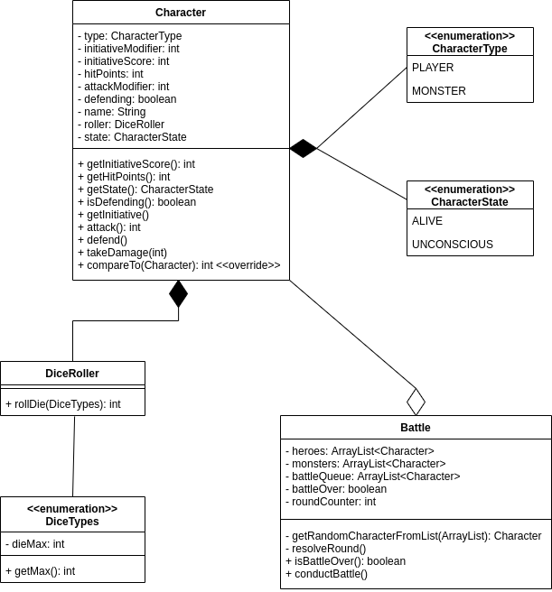

# Class Diagram

### Explanation

An ideal design would not make use of the abstract `Character` class (though this had no impact on your grade), because the inheritance relationships do not specialize the `Player` and `Monster` classes in any meaningful way.
